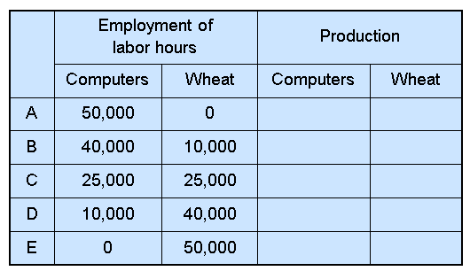
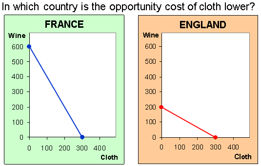
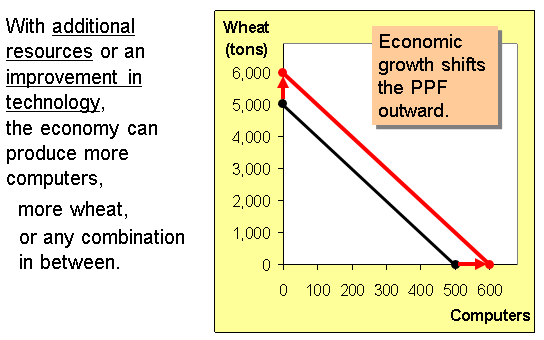
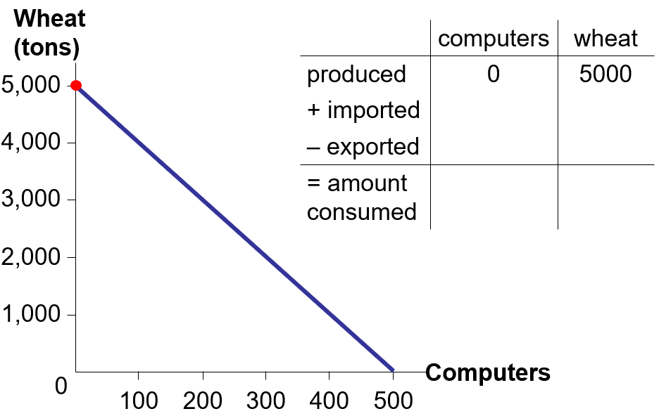
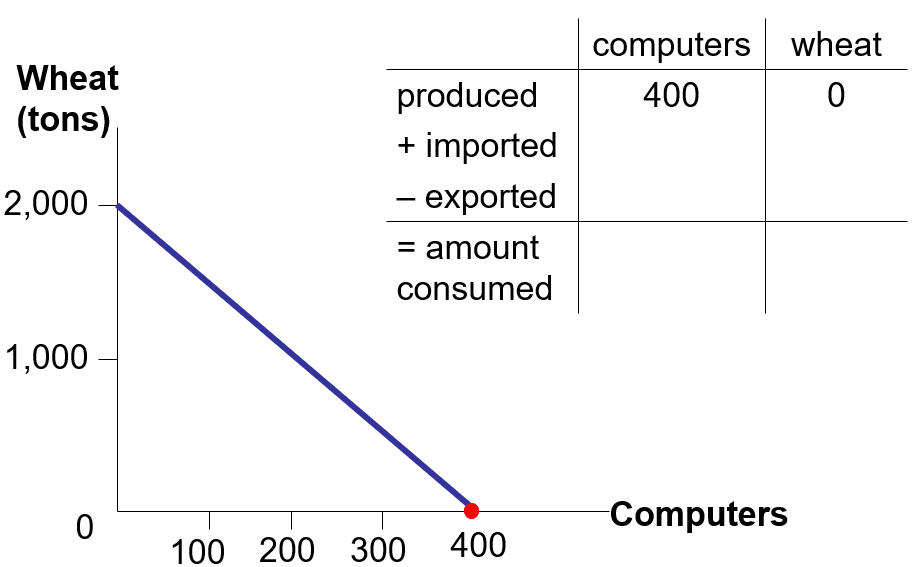
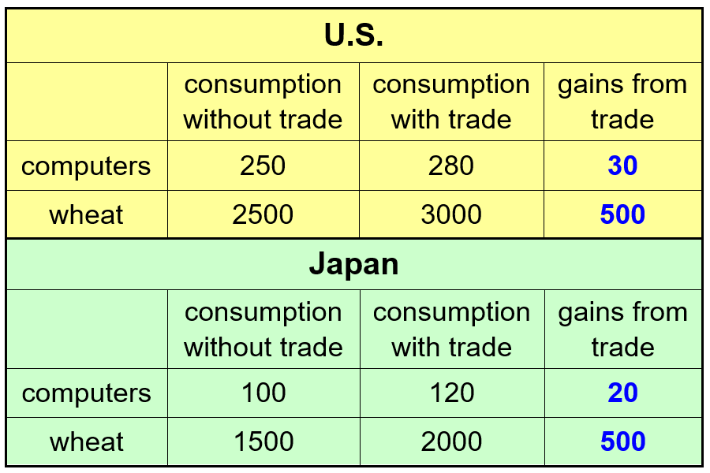
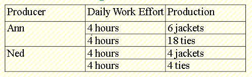

# Principles of Trade and interdependence: Absolute and Comparative advantage

## Learning Objectives $\triangleleft$

In this chapter, you will be able to answer the following:

+ What are economists' two roles?  How do they differ? 

+ What are models?  How do economists use them?

+ How is the \textbf{Production Possibilities Frontier (PPF)} related to opportunity cost?  How does it help us understand gains from trade?

+ What is the difference between absolute and comparative advantage

+ What is the difference between positive and normative statement? 

			
## What do Economist Do?

+ The two main roles of Economists:
 - Scientists:  they try to explain the world
 - Policy advisers:  try to improve the world

+ As scientists, economists employ the scientific method, objective development and testing of theories about how the world works. 

+ Unlike the natural sciences, economists use mainly historical or survey data and less on lab experiments, which is difficult if not impossible in economics-- especially for the macroeconomy

+ As policy advisers, economists fight poverty, inflation, unemployment, etc.

			
## Economists as Scientists: Assumptions \& Models 

+ As scientists, economists build ***models*** to understand the world

+ ***Model***:  a highly simplified representation of a reality.

+ we use ***assumptions*** to simplify the complex world, make it easier to understand. 

 - Example 1: To study int'l trade, we will assume two countries and two goods.  Unrealistic, but simple to learn and gives useful insights about the real world.
    
 - Example 2: To understand relationship between two variables, it is often assumed that all other relevant factors remain unchanged, or "other things equal" or ceteris paribus in latin.

## Example Model: The Production Possibilities Frontier

+ The Production Possibilities Frontier (PPF): a graph that shows the combinations of two goods the economy can possibly produce given the available resources and the available technology  

+ Example:  

Two goods:  computers and wheat 

One resource:  labor (measured in hours) 

Economy has 50,000 labor hours per week available for production. 

## PPF Example: Complete the table $\triangleleft$

+ Producing one computer requires 100 labor hours.

+ Producing one ton of wheat requires 10 labor hours.

{height=60%}

## PPF Example: Translate to graph $\triangleleft$

{height=75%}

## Exercise: Points on the PPF?
a.  On the graph, find the point that represents (100 computers, 3000 tons of wheat), label it \textbf{F}.   Would it be possible for the economy to produce this combination of the two goods? Why or why not?  

b.  Next, find the point that represents (300 computers, 3500 tons of wheat), label it \textbf{G}.  Would it be possible for the economy to produce this combination of the two goods?

##  The PPF and Opportunity Cost

+ The Opportunity Cost of good X
$$= \frac{\textit{Additional amount of Y given up}}{\textit{Additional amount of X Obtained}} = |\frac{\Delta Y}{\Delta X} | = |slope|$$

+ Exercise: What is the Opportunity cost of producing Wheat for the previous PPF? and of Computer?

## Active Learning 2: PPF and Opprtunity Cost $\triangleleft$
{height=50%}

## Economic Growth and the PPF

{height=50%}

## Absolute and Comparative Advantage: 

### First Example

+ Assumptions:

 + Two countries:  the U.S. and the Rest of the World (RoW)

 + Two goods:  computers and wheat 

 + One resource:  labor, measured in hours 
  
+ We will look at how much of both goods each country produces and consumes

 - if the country chooses to be self-sufficient 
 - if it trades with the other country

+ In U.S., Producing 1 computer requires 100 labor hours and 
Producing 1 ton of wheat requires 10 hours labor.

+ In the ROW, Producing 1 computer requires 90 labor hours and Producing 1 ton of wheat requires 15 hours labor.

+ Then:

  a. Which country is more efficient in the production of computers?

  b. Which country is more efficient in the production of wheat?

  c. So can U.S. gain from trade with ROW?

\textcolor{red}{\textbf{Absolute advantage:}}

			
## Absolute Advantage 

+ \textcolor{red}{\textbf{Absolute advantage:}}  the ability to produce a good using fewer inputs than another producer 

 + Which country has an absolute advantage in computers? 

 + Which country has an absolute advantage in wheat?

## Another Example: U.S. \& Japan  $\triangleleft$

+  U.S. again has 50,000 hours of labor per month available for production.

 - Producing 1 computer requires 100 hours of labor.  Producing 1 ton of wheat requires 10 hours of labor.

+  Japan has also 50,000 hours of labor available for production, per month. 

 - Producing 1 computer requires 125 hours of labor.  Producing 1 ton of wheat requires 25 hours of labor.

+  Which country has absolute adv. in the production of wheat? in the production of computers?  Can U.S. benefit in trade with Japan?

			
## U.S and Japan without Trade  $\triangleleft$
+ Suppose U.S. allocates its resources 50-50 to each good, while Japan allocates 1/4 on computers and 3/4 on wheat. Locate this in each country's PPF.  (Without trade each country consumes what it produces, no more no less!)

\centering
{height=75%}

## *Active Learning:* $\triangleleft$ 

+  If U.S. specializes only in computers, what is the maximum number of computers it can produce? locate this point on the U.S. PPF.

+  Suppose Japan produces only 400 computers.  How many tons of wheat would Japan be able to produce with its remaining labor?  Draw this point on Japan's PPF.

			
##  Basic International Trade Terms

+  \textcolor{red}{\textbf{Exports: }} goods produced domestically and sold abroad
  
 - \textbf{To export} means to sell domestically produced goods abroad.

+  \textcolor{red}{\textbf{Imports: }} goods produced abroad and sold domestically

 - \textbf{To import} means to purchase goods produced in other countries.  

 

			
## Activity: Consumption With Trade   $\triangleleft$

Suppose the U.S. exports 2000 tons of wheat to Japan, and imports 280 computers from Japan.

\bigskip
(So, Japan imports 2000 tons wheat and exports 280 computers. The rate of exchange is called terms of trade)

+  How much of each good is consumed in the U.S.? Plot this combination on the U.S. PPF. 

+  How much of each good is consumed in Japan?

  Plot this combination on Japan's PPF. 

			
##  U.S. Production and Consumption With Trade  $\triangleleft$

{height=75%}

			
## Japan's production and Consumption With Trade  $\triangleleft$
{height=75%}

##  Trade Makes Both Countries Better Off  $\triangleleft$

{height=75%}

\textcolor{red}{\textbf{Comparative Advantage:}}

## Where Do These Gains Come From? 

+  So, the U.S. has an absolute advantage in both goods but can again from trade with Japan!

+  why does Japan specialize in computers?  Why do \underline{both} countries gain from trade?

+  Or can absolute advantage explain the possibility of trade between the countries?

##  Opportunity Cost and Comparative Advantage
+  Recall: Another measure of cost is opportunity cost.

+  ***Comparative advantage:***  the ability to produce

a good at a lower opportunity cost than another producer  

+  Which country has the comparative advantage in computers?  

+  Which country has the comparative advantage in wheat?

\bigskip

***Lesson***: Absolute advantage is not necessary for comparative advantage or for trade! Comparative advantage is!

## Comparative Advantage and Trade 

+  Gains from trade arise from comparative advantage (differences in opportunity costs).

+  Specialization and trading according to comparative advantage increases world production and consumption. (each country still produce on its PPF but can consume combinations outside its PPF)

+  The same applies to individual producers (like the farmer and the rancher) specializing  in different goods and trading with each other.  

## *Active Learning 1: Absolute \& comparative advantage*

+ Argentina and Brazil each have 10,000 hours of labor per month.

 - In Argentina:
   + producing one pound coffee requires 2 hours
   + producing one bottle wine requires 4 hours

 - In Brazil: 
	 + producing one pound coffee requires 1 hour
	 + producing one bottle wine requires 5 hours

a. Which country has an absolute advantage in the production of coffee ?

b. Which country has a comparative advantage in the production of wine?

## *Active Learning 2: Absolute \& comparative advantage* $\triangleleft$

{height=75%}

\small

Assuming each worker has only 8 hours daily for production:

a. Who has absolute advantage in the production of jackets? ties?

b. Who has comp. advantage in the production of jackets? ties?

c. Suppose the terms of trade were 1 jacket to 2 ties, show how each person is made better off through specialization and trade 

## *Active Learning 3: Absolute \& comparative advantage*  $\triangleleft$

+ Germany can produce 2 computers per minute or 1 tractor per minute while the U.S. can produce 3 computers of 2 tractors per minute. Draw the implied PPF and show:

  a. Which country has absolute advantage in computers? in tractors?

  b. Which country has comp. advantage in computers? in tractors?

  c. what is the range in which trade can benefit both countries.

## *Active Learning 4: Absolute \& comparative advantage*  $\diamond$

Assume that England and Spain can switch between producing cheese and producing bread at a constant rate.

{height=100%}

a. Which country has absolute advantage in Cheese? in bread?

b. Which country has comp. advantage in Cheese? in bread?

			
## Unanswered Questions \ldots 

+  We made a lot of assumptions about the quantities of each good that each country produces, trades, and consumes, and the price at which the countries trade wheat for computers.  

+  In the real world, these quantities and prices would be determined by the preferences of consumers and the technology and resources in both countries.  

+  We will begin to study this in the next chapter. For now, though, our goal was merely to see how \textcolor{blue}{trade can make everyone better off.}

 

## CHAPTER SUMMARY 

+  Interdependence and trade allow everyone to enjoy a greater quantity and variety of goods \& services.  

+  Comparative advantage means being able to produce a good at a lower opportunity cost.  Absolute advantage means being able to produce a good with fewer inputs.  

+  When people – or countries – specialize in the goods in which they have a comparative advantage, the economic ``pie'' grows and trade can make everyone better off.

## The Economist as Policy Advisor 

+ As scientists, economists make \textcolor{red}{\textbf{positive statements,}} which attempt to describe the world as it is.  

+ As policy advisors, economists make \textcolor{red}{\textbf{normative statements,}} which attempt to prescribe how the world should be.
  
+ Positive statements can be confirmed or refuted, normative statements cannot.

## ***ACTIVE  LEARNING: Identifying positive vs. normative*** $\triangleleft$

Which of these statements are “positive” and which are “normative”?  How can you tell the difference?

a. Prices rise when the government increases the quantity of money.  

b. The government should print less money.  

c.  A tax cut is needed to stimulate the economy. 

d.  An increase in the price of burritos will cause an increase in consumer demand for video rentals.

## Why Economists Disagree 

Economists sometimes give conflicting policy advice. 

+ They sometimes disagree about the validity of alternative positive theories about the world. 

+ They may have different values and, therefore, different normative views about what policy should try to accomplish.  

Yet, there are many propositions about which most economists agree.

## Propositions about Which Most Economists Agree  (and \% who agree) 
+ A ceiling on rents reduces the quantity and quality of housing available.  (93\%)

+ Tariffs and import quotas usually reduce general economic welfare.  (93\%)

+ The United States should not restrict employers from outsourcing work to foreign countries. (90\%)

+ The United States should eliminate agriculture subsidies. (85\%)

## FYI:  Who Studies Economics? 

+ Tiger Woods, Golfer
+ Ronald Reagan, President of the United States
+ Barbara Boxer, U.S. Senator 
+ Sandra Day-O’Connor, Former Supreme Court Justice
+ Anthony Zinni, Former General, U.S. Marine Corps 
+ Kofi Annan, Former Secretary General, United Nations
+ Meg Witman, Chief Executive Officer, eBay
+ Steve Ballmer, Chief Executive Officer, Microsoft
+ Arnold Schwarzenegger, Governor of California, Actor
+ Ben Stein, Political Speechwriter, Actor, Game Show Host
+ Mick Jagger, Singer for the Rolling Stones 
+ John Elway, NFL Quarterback
+ Diane von Furstenburg, Fashion Designer

##  CHAPTER SUMMARY

+ As scientists, economists try to explain the world using models with appropriate assumptions.  

+ A sample model is the Production Possibilities Frontier and its useful application in explaining trade and interdependence. 

+ As policy advisers, economists offer advice on how to improve the world. 

